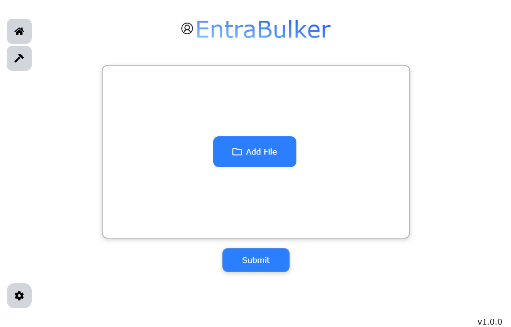

# EntraBulker

*EntraBulker* is a customizable application that generates CSV files for bulking Entra ID identities 
without the need for API access. It is a WebView application built with Python, TypeScript, and JavaScript.

## Install

The application is ***only supported on Windows.***

The installation files can be retrieved from the [releases page](https://github.com/bobllor/EntraBulker/releases/latest).
The files consist of either a binary or ZIP file containing the files to run.

The binary is a standalone installer that installs the program onto your device.
- The default installation path is `$HOME\AppData\Programs\EntraBulker`, the path can be changed as needed.
- It is the recommended way as it creates a shortcut automatically and can be uninstalled via *Control Panel*.

The ZIP file has a folder structure like so (which is the same as the binary installer above):
- `entrabulker`
    - `apps`
        - `madist`
        - `EntraBulker.exe`: Main application
    - `udist`
    - `EntraUpdater.exe`

The files can be extracted to a given location and the application can be launched via `EntraBulker.exe` located in the `apps` folder.
It is *recommended* to make a shortcut of `EntraBulker.exe` in order to use it outside of the folder.

## Example

An example input file:

| Full name | Organization |
| --- | --- |
| John Doe | Company One |
| Jane Doe | Company One |
| James Smith | Company Two |
| Jackson Crane | Company Three |
| Kyle Shanks | Company One |

The output file (version row excluded):

| Name [displayName] Required | User name [userPrincipalName] Required | Initial password [passwordProfile] Required | Block sign in (Yes/No) [accountEnabled] Required | First name [givenName] | Last name [surname] |
| --- | --- | --- | --- | --- | --- |
| John Doe | John.Doe@company.one.org | F7nC?o/i_"N(WvHE | No | John | Doe |
| Jane Doe | Jane.Doe@company.one.org | FGpE&=mH`{kg6#X, | No | Jane | Doe |
| James Smith | James.Smith@two.company.com | "_.2yCcr"U!eX\|"y | No | James | Smith |
| Jackson Crane | Jackson.Crane@company.three.com | "9++z1JtFNmUCKbR | No | Jackson | Crane |
| Kyle Shanks | Kyle.Shanks@company.one.org | =?y[tYsSiRQA4UxJ | No | Kyle | Shanks |

## Usage

**NOTE**: The application does not account for existing identities in Entra ID. The application is solely used to
bulk accounts, as it is intended to not rely on an API access.

The application has two ways to generate CSV files:
1. File uploading: The home screen/default screen on first launch
2. Manual entries

Both ways features a submit button, which when submitted, the files will be generated to an output folder. 
By default, this is your *home* folder, which can be changed in the *General settings tab*.

The navigation bar can be found on the right side of the application, and can access the *home, manual entries (custom), and setting pages*.

### Settings

The settings allow customization on how the application will function. There are five tabs:
1. [General](./docs/settings/general.md): General settings of the program
2. [Headers](./docs/settings/headers.md): Column headers mapping (column names to internal variable mappings)
3. [Organization](./docs/settings/organization.md): Key-value mapping to map a domain name to an organization key
4. [Password](./docs/settings/password.md): Password related settings for random password generation
5. [Text Template](./docs/settings/text_template.md): Settings for generating text templates for each entry in the file

### Side Effects

Before the CSV file is generated, there are side effects during the data parsing process:
1. **Duplicate names**: If duplicate names are found in the files (e.g. `John Doe` and `John Doe`), 
a number will be attached to *their username*: `John.Doe@domain.com` and `John.Doe1@domain.com`.
2. **Empty name entries**: If *empty names* are found in any of the three name columns, then *that row
will be dropped*.
3. **Passwords**: Password generation is built in, random, and cannot be disabled. The output password
can be modified in the *Password settings tab*.

### File Uploading

The application only supports CSV (`.csv`) and Excel (`.xlsx`) files.

The files are expected to have the following columns (or any related columns). These columns can be mapped
to any value as needed in the *Headers settings tab*. The following columns are expected:
1. Full Name*
2. Organization
3. First Name*
4. Last Name*

\*The names are dependent on the option `First/Last Name Headers` in the *General settings tab*, which is *off by default*.
The program **looks for a Full name column** by default, but if First and Last name columns are required, then enabling the 
option will change the program to look for both columns instead of the single column.

It is important to note that the column mappings can be changed inside the ***Headers settings tab*** if the default values
do not match your columns. More information can be read [here](./docs/settings/headers.md).

### Manual Entries

Manual CSV generation is supported if file uploads are not needed.
The page for manual entries can be accessed via the *Hammer* icon on the navigation bar, known as *Custom*.

There are two field entries:
1. Name: The name of the account
2. Organization: The organization of the user 

The organization does not need to be a literal organization, it is used as the value to the key-value mapping
for a domain name (e.g. `Conmpany one` -> `user.one@company.one.com`). This can be modified in the **Organization settings tab**, 
which can be read more about [here](./docs/settings/organization.md).

## Development

To start development: