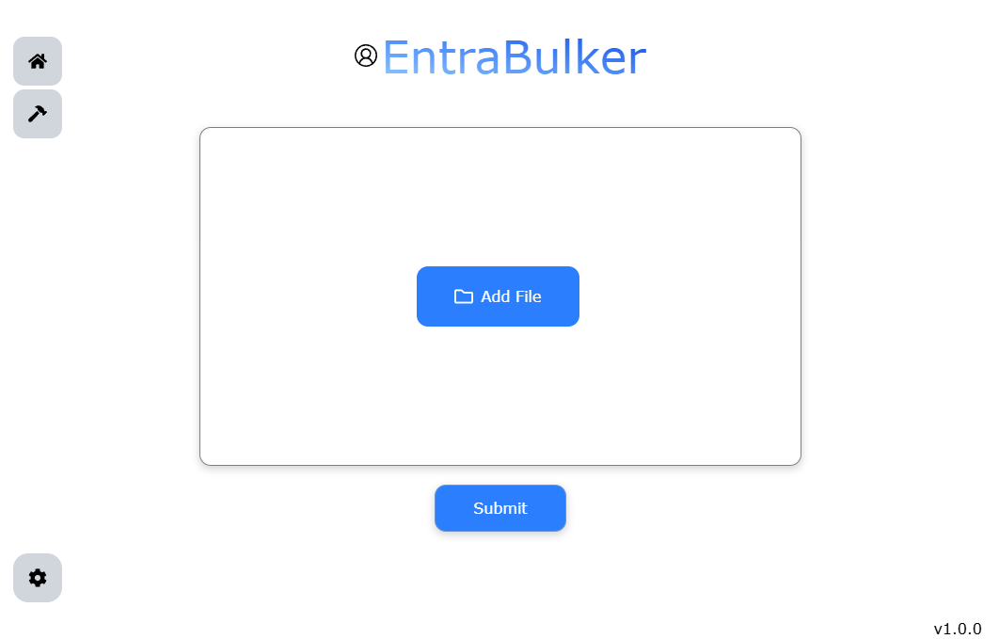
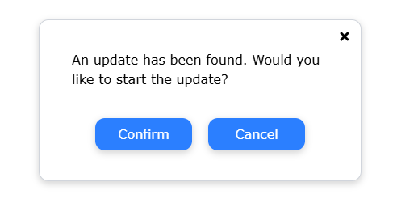

# EntraBulker

*EntraBulker* is a customizable application that streamlines large-scale user onboarding in Microsoft Entra ID by
transforming CSV and Excel reports into bulk user creation data. 
It can generate *ready to use CSV bulk files* or directly *create users in a tenant* via Graph API using 
a registered application.

It is a WebView desktop application built with Python, TypeScript, and JavaScript, to assist administrators in
automating user creation with Entra ID.

## Example

Below is an example of what an expected report file would look like:

| Full name | Organization |
| --- | --- |
| John Doe | Company One |
| Jane Doe | Company One |
| James Smith | Company Two |
| Jackson Crane | Company Three |
| Kyle Shanks | Company One |

The output file (version row excluded):

| Name [displayName] Required | User name [userPrincipalName] Required | Initial password [passwordProfile] Required | Block sign in (Yes/No) [accountEnabled] Required | First name [givenName] | Last name [surname] |
| --- | --- | --- | --- | --- | --- |
| John Doe | John.Doe@company.one.org | F7nC?o/i_"N(WvHE | No | John | Doe |
| Jane Doe | Jane.Doe@company.one.org | FGpE&=mH`{kg6#X, | No | Jane | Doe |
| James Smith | James.Smith@two.company.com | "_.2yCcr"U!eX\|"y | No | James | Smith |
| Jackson Crane | Jackson.Crane@company.three.com | "9++z1JtFNmUCKbR | No | Jackson | Crane |
| Kyle Shanks | Kyle.Shanks@company.one.org | =?y[tYsSiRQA4UxJ | No | Kyle | Shanks |

The output file can now be uploaded to Azure Entra ID and bulk create all rows of the file.

## Table of Contents

- [Installation](#installation)
- [Usage](#usage)
    - [Settings](#settings)
    - [Side Effects](#side-effects)
    - [File Uploading](#file-uploading)
    - [Manual Entries](#manual-entries)
    - [Updating](#updating)
- [Microsoft Graph](#microsoft-graph)
    - [Registering an Application](#registering-an-application)
    - [Setup](#setup)
    - [Usage](#usage-1)
    - [Caching](#caching)
- [Development](#development)
    - [Initializing Project](#initializing-project)
    - [Running the Application](#running-the-application)

## Installation

The application is ***only supported on Windows.***

The installation files can be retrieved from the [releases page](https://github.com/bobllor/EntraBulker/releases/latest).
The files consist of either a binary or ZIP file containing the files to run.

The binary is a standalone installer that installs the program onto your device.
- The default installation path is `$HOME\AppData\Programs\EntraBulker`, the path can be changed as needed.
- It is the recommended way as it creates a shortcut automatically and can be uninstalled via *Control Panel*.

The ZIP file has a folder structure like so (which is the same as the binary installer above):
- `entrabulker`
    - `apps`
        - `madist`
        - `EntraBulker.exe`: Main application
    - `udist`
    - `EntraUpdater.exe`

The files can be extracted to a given location and the application can be launched via `EntraBulker.exe` located in the `apps` folder.
It is *recommended* to make a shortcut of `EntraBulker.exe` in order to use it outside of the folder.

## Usage

**NOTE**: The application does not account for existing identities in Entra ID. The application is solely used to
bulk accounts, as it does not rely on having API access.

The application has two ways to generate CSV files:
1. **File uploading**: The home screen/default screen on first launch
2. **Manual entries**

Both ways features a submit button, which when submitted, the files will be generated to an output folder. 
By default, this is your *home* folder, which can be changed in the *General settings tab*.

The navigation bar can be found on the right side of the application, and can access the *home, manual entries (custom), and setting pages*.



### Settings

The settings allow customization on how the application will function. There are five tabs:
1. [General](./docs/settings/general.md): General settings of the program
2. [Headers](./docs/settings/headers.md): Column headers mapping (column names to internal variable mappings)
3. [Organization](./docs/settings/organization.md): Key-value mapping to map a domain name to an organization key
4. [Password](./docs/settings/password.md): Password related settings for random password generation
5. [Text Template](./docs/settings/text_template.md): Settings for generating text templates for each entry in the file
6. [Microsoft Graph](./docs/settings/microsoft_graph.md): Settings related to Microsoft Graph

Question marks can be found in all the Setting pages, hovering over them will reveal a tooltip on what it does.

### Side Effects

Before the CSV file is generated, there are side effects during the data parsing process:
1. **Duplicate names**: If duplicate names are found in the files (e.g. `John Doe` and `John Doe`), 
a number will be attached to *their username*: `John.Doe@domain.com` and `John.Doe1@domain.com`.
2. **Empty name entries**: If *empty names* are found in any of the three name columns, then *that row
will be dropped*.
3. **Passwords**: Password generation is built in, random, and cannot be disabled. The output password
can be modified in the *Password settings tab*.

### File Uploading

The application only supports CSV (`.csv`) and Excel (`.xlsx`) files.

The files are expected to have the following columns (or any related columns). These columns can be mapped
to any value as needed in the *Headers settings tab*. The following columns are expected:
1. **Full Name\***
2. **Organization**
3. **First Name\***
4. **Last Name\***

\*The names are dependent on the option `First/Last Name Headers` in the *General settings tab*, which is *off by default*.
The program **looks for a Full name column** by default, but if First and Last name columns are required, then enabling the 
option will change the program to look for both columns instead of the single column.

It is important to note that the column mappings can be changed inside the ***Headers settings tab*** if the default values
do not match your columns. More information can be read [here](./docs/settings/headers.md).

### Manual Entries

Manual CSV generation is supported if file uploads are not needed.
The page for manual entries can be accessed via the *Hammer* icon on the navigation bar, known as *Custom*.

There are two field entries:
1. **Name**: The name of the account
2. **Organization**: The organization of the user 

The organization does not need to be a literal organization, it is used as the value to the key-value mapping
for a domain name (e.g. `Conmpany one` -> `user.one@company.one.com`). This can be modified in the **Organization settings tab**, 
which can be read more about [here](./docs/settings/organization.md).

### Updating

If an update is available, the application will prompt a modal informing an update has been found. If accepted,
an automatic updating process occurs with the binary `EntraUpdater.exe`.
- This requires an active network connection and Github must be accessible. Having a network connection
*does not affect normal program usage*.



Updating can be done through using the new binary installer or replacing the files with the new files from the ZIP file.
- The default path of the application via installer is `$HOME\AppData\Programs\EntraBulker`.

## Microsoft Graph

The application supports Microsoft Graph API to create users directly into the tenant during a submission.
It is a *public client* which uses *delegated permissions* to perform the tasks.

To enable Graph support and start the workflow:
- An application must be registered and configured in the tenant
- The option `Enable Graph` in the `Microsoft Graph` settings must be enabled
- There are valid IDs for *application (client) ID and directory (tenant) ID*
- You have a valid access token for Graph, obtained via authentication by signing in

### Registering an Application

In order to use Graph, a *registered application* is required in your Entra ID tenant. Microsoft provides official
documentation on [how to register one](https://learn.microsoft.com/en-us/entra/identity-platform/quickstart-register-app).

1. Register an application on Entra ID
2. Configure a *Mobile and desktop applications* redirect URI
    - The value of the redirect URI is dependent on your requirements, if you are unsure
    `http://localhost:8400`, or a port of your choosing, is recommended
3. Record the *client ID and tenant ID* 
4. Enable delegated permissions in the application for `User.ReadWrite.All`

### Setup

Once an application is registered, the application will need to be setup with the values
in order to obtain an access token. This is done through the `Microsoft Graph` *settings page*
of the application.

1. Using the *client ID and tenant ID*, input the values in their respective fields
2. Sign in to authenticate

Once authenticated, the program is ready to use Graph to create the users.

### Usage

With Graph, the users are directly created in the tenant. The workflow *process remains the exact same*, creating
the CSV file and template if enabled.
After the CSV file is generated to the output folder, Graph will run at this stage and add the users to the tenant.
- The output files are generated for onboarding the end user and as a fallback for offline workflows.

> DISCLAIMER
>
> Graph API require network requests and will be slower than the offline CSV processing.

All errors will be logged, including the reason why the Graph POST failed and for which users.

### Caching

When you authenticate for the first time, your *access token is cached* to an *encrypted file*
on the disk. This is to reauthenticate with the access token without having to go through 
the full authentication process again.
- If your device *does not support encryption*, then it will fall back to *plain text*
- The cached token will be used to renew the access token, even if it is already expired

If the cached access token is not available, then the system's *default browser* is opened to a page of
your tenant's authority URI. The account used to login *must be in the same tenant* as where the
application is registered. 
- There is a *2 minute timeout* on the authentication process, if this timeout is reached it will
abort the authentication

Multiple accounts *are not supported*. If a different account needs to be used, then the
*you will need to clear the cache*.
This will remove the cached access token and the cached accounts, allowing you to authenticate
with a different account.

The authentication is revoked when the application is closed. Launching the application again
will require you to sign back in manually. There is a checkbox `Stay signed in` that if checked,
the program will attempt to *reauthenticate on every reboot* using the cached token.

## Development

Development is supported on Linux and Windows. 
Windows is expected to ***use Git Bash***, with support scripts being written in Bash.

*PowerShell* is used when compiling the binaries and installer.

The following software are required:
- `Node.js` >= 22.11.0
- `npm` >= 11.1.0
- `Python` >= 3.12.6
- `Git`

Optional software:
- `InnoSetup` >= 6.4.3: Only if compiling the installer is required

### Initializing Project

```shell
# clone the repository
git clone https://github.com/bobllor/EntraBulker
cd EntraBulker

# create the venv and install required packages
py -m venv .venv
source .venv/scripts/activate
pip install -r requirements.txt

# setup the node_modules for each react project
bash npm-install.sh
```

### Running the Application

There are two folders for the frontend, each used for a different application:
1. `01-bulker-app`: The main application
2. `02-updater-app`: The updater application

There are *two Python files* that serve each frontend respectively:
1. `main.py`: The main application
2. `updater_main.py`: The updater application

There is a support file `run.sh` that is used to run the server, with its argument expected to be
the folder path of either frontend folders. For example, to run the main application: `bash run.sh 01-bulker-app`.

This *requires two separate terminals* in order to run:
one to start the local server and one to start the application.

```shell
# main application
bash run.sh 01-bulker-app

# ran in second terminal
py backend/main.py

# updater application
bash run.sh 02-updater-app

# ran in second terminal
py backend/updater_main.py
```