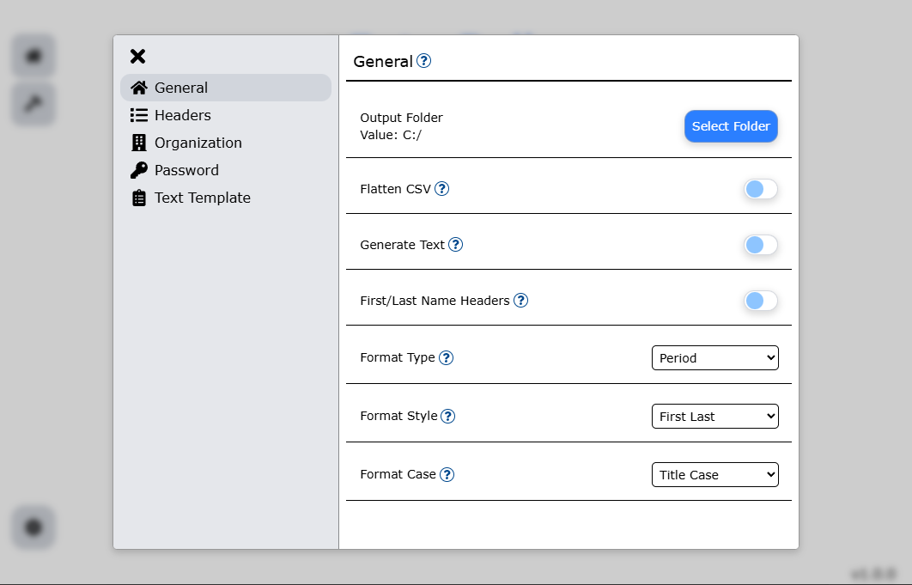

# General Settings

The General settings has options that modifies the output file and the option to enable first/last name columns.

## Table of Contents

- [Flatten CSV](#flatten-csv)
- [Generate Text](#generate-text)
- [First/Last Name Headers](#firstlast-name-headers)
    - [Example](#example)
- [Name Formatting](#name-formatting)
    - [Format Type](#format-type)
    - [Format Style](#format-style)
    - [Format Case](#format-case)

## Flatten CSV

By default, each file uploaded will have its own CSV output. If a single file is preferred, the
`Flatten CSV` option *merges all uploaded files into a single CSV output*.

Additionally, if *Generate Text is enabled*, then all generated template files will be outputted to the same folder.

## Generate Text

Generate Text enables text generation for each user in the file. This allows for *sharing login information* or
creating other types of templates This requires a *non-empty text template* that can be set 
in the [Text Template settings tab](./text_template.md).

This will create a new folder in the output path called `templates`, and will contain a subfolder that holds the files for
each uploaded file with a unique hash attached to the name. A *new unique subfolder is created for each uploaded input file*.
- If `Flatten CSV` is enabled, then template files will be generated in the same subfolder for all uploaded files.

## First/Last Name Headers

By default, *a single full name column* for the name of the user. `First/Last Name Headers` enables the support of 
the double column, used if input ifles do not have a full name column but two columns for first/last.

The `First/Last Name Headers` option changes this to read two columns instead of one. 
The First/Last Name columns are as *defined in the [Headers tab](./headers.md)*.

### Example

The example will use the default header values (First name/Last name).

Input file:

| First name | Last name | Operating company |
| --- | --- | --- |
| John | Doe | Company one |
| Jane | Doe | Company one |
| James | Smith | Company two |

Output file (version row excluded):

| Name [displayName] Required | User name [userPrincipalName] Required | Initial password [passwordProfile] Required | Block sign in (Yes/No) [accountEnabled] Required | First name [givenName] | Last name [surname] |
| --- | --- | --- | --- | --- | --- |
| John Doe | John.Doe@company.one.org | F7nC?o/i_"N(WvHE | No | John | Doe |
| Jane Doe | Jane.Doe@company.one.org | FGpE&=mH`{kg6#X, | No | Jane | Doe |
| James Smith | James.Smith@two.company.com | "_.2yCcr"U!eX\|"y | No | James | Smith |

The output is the same as if it were using the Full name column only.

## Name Formatting

The application generates usernames as the format `First.Last@domain.com` by default, using the first and last names
of the user. This can be modified with the name formatting options.

There are three dropdown menu options which is used to format the username based off of their names:
1. [**Format type**](#format-type): The type of format used on the username
2. [**Format style**](#format-style): The username will appear based off of the name
3. [**Format case**](#format-case): The casing of the username based off of the name

### Format Type

Consists of two options:
1. **Period**: Adds a period for the username: `John.Doe@domain.com` (default)
2. **No space**: Does not add a space for the username: `JohnDoe@domain.com`

### Format Style

Consists of three options:
1. **First Last**: Takes the full first and last name: `John.Doe@domain.com` (default)
2. **F Last**: Takes the first letter of the first name and the full last name: `J.Doe@domain.com`
3. **First L**: Takes the full first and first letter of the last name: `John.D@domain.com`

### Format Case

Consists of three options:
1. **Uppercase**: Username portion is entirely uppercase: `JOHN.DOE@domain.com`
2. **Lowercase**: Username portion is entirely lowercase: `john.doe@domain.com`
3. **Title case**: Username portion is in title case: `John.Doe@domain.com` (default)

This only effects the display in the system, usernames are case insensitive and does not effect
how it will be used.