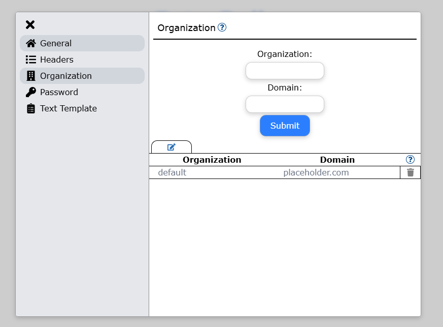
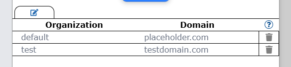
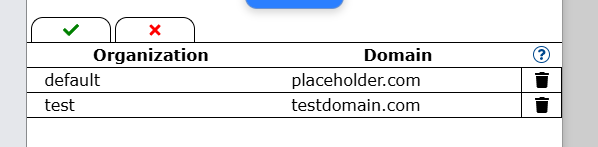

# Organization Settings

The Organization settings enables mapping of Organizations (or another criteria) keys to Domain values.
An example: 
- Key-value pair `<Accounting>-<accounting.company.org>`
- Data is parsed and the Organization `Accounting` is found, the end username is `First.Name@accounting.company.org`.

On the page consists of a form and a table.
- The form is used for entering a new Organization-Domain entry.
- The table provides information on the current entries, but also allowing modifications such as changing or
deleting entries.

All entries *are converted to lowercase automatically*.

By default, there exists one entry at all times: the *Default entry*. This entry is used when the program is unable
to find a match with the Organization column in the file, the default domain will be used instead.
- This entry **cannot be deleted** and only the *Domain value* can be modified.

## Form

The form is used for *adding key-value pairs* to the backend for account creation.
There are two fields in the form:
1. *Organization*: The criteria used for the domain mapping.
2. *Domain*: The domain used for the account based on the organization value.

The domain entry does not use the `@` symbol, and if included will be removed automatically.
- By default, the program already appends the `@` symbol to the email.

When a successful key-value pair is submitted, a new entry will be added into the table below.

There is no restriction on what can be entered, *except* that there cannot be *duplicate Organizations*. 
Attempting to add a duplicate Organization will be prevented and an error toast will show.
- The domain given *must exist in your tenant*, otherwise the account will not be created.

## Table

The table holds the data of the current entries for the key-value pairs. The entries in the table show what
domain the account will get based on the criteria of the output.

The entries *can be modified* if it needs to be changed. An Edit button can be found at the top left of the table
which changes the table state to Edit mode. 
When enabled, the text and the Trash icon will go from gray to black.

The Edit button is replaced with two buttons, a Save and Cancel button.
- The Save button is used to finalize changes done while in Edit mode.
- The Cancel button is used to cancel changes done while in Edit mode.

**WARNING**: Deleting row and then canceling **will not** cause rows to come back. Once deleted, it is gone permanently.

### Modifying Entries

This requires the table to be in Edit mode.

When the table is in Edit mode, all columns' text values can be edited to a different value. The *Save button* is used to
save and finalize the modifications and update the entries for the program.

***Duplicate keys*** are not allowed. If a key value is changed to another existing key and saved,
**all modified data will be lost** and the *table will be reset to its previous state*.

The Organization text of the *Default entry cannot be modified*. Only the *Domain text can be modified*. 

### Deleting Entries

**WARNING**: Deleting entries is permanent, it will remove the entry immediately.

This requires the table to be in Edit mode.
Entries can be deleted by clicking the Trash button on the target row. 

Deleting the Default entry *is not allowed*, and will be met with an error toast if it is attempted.